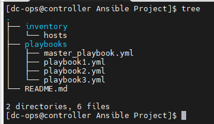
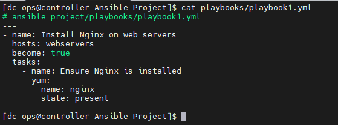
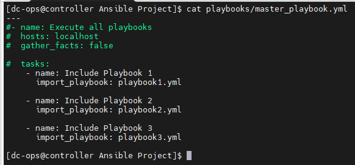

 # A small project in Ansible with a master playbook that calls three other playbooks. 
 
 Here’s an end-to-end guide:

 ## Project Structure:

 #### First, let's define the structure of the project. We'll have a directory for our "Ansible project" and inside it, we'll have the main playbook and the sub-playbooks.



## Inventory File:

We created the inventory file hosts, which defined our target hosts.


### Playbooks:

Now, let’s create three simple playbooks that perform basic tasks.

#### Playbook 1: Install Nginx


#### Playbook 2: Start Nginx


#### Playbook 3: Configure Database


#### Master Playbook


### Explanation:

#### 01. Project Structure:
        - playbooks/: Contains all the playbooks.
        - inventory/: Contains the inventory file defining target hosts.

#### 02. Inventory File:

        - Defines two groups of servers: webservers and dbservers.
        - Each host is specified with its IP address and SSH user.

#### 03. Playbook 1 (Install Nginx):

        - Targets "webservers".
        - Ensures Nginx is installed using the apt module.
#### 04. Playbook 2 (Start Nginx):

        - Targets "webservers".
        - Ensures Nginx service is started using the service module.

#### 05. Playbook 3 (Configure Database):

       - Targets "dbservers".
       - Installs MySQL and ensures the service is running.

#### 06. Master Playbook:

        Runs on localhost to coordinate the execution.
        Uses import_playbook to sequentially call the three playbooks.

### Running the Playbooks

To run the master playbook, navigate to the ansible_project directory and execute:

```bash
ansible-playbook -i inventory/hosts playbooks/master_playbook.yml
```


