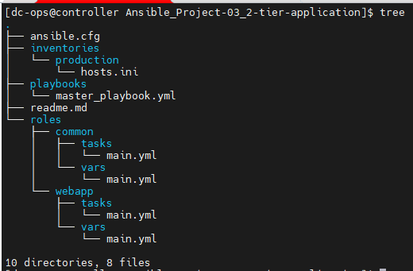

# Designing a 2-tier application deployment with Ansible

## Project Structure:



### hosts.ini file inside the inventories/production/ directory:

```ini
[redhat]
Node01 ansible_host=node01
Node02 ansible_host=node02
Node03 ansible_host=node03


[ubuntu]
Node04

[debian]
Node05
```
### ansible.cfg details
``` ini
[defaults]
roles_path = roles
```
