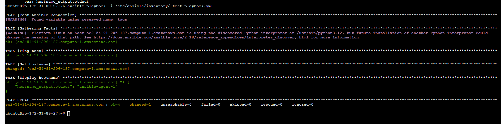
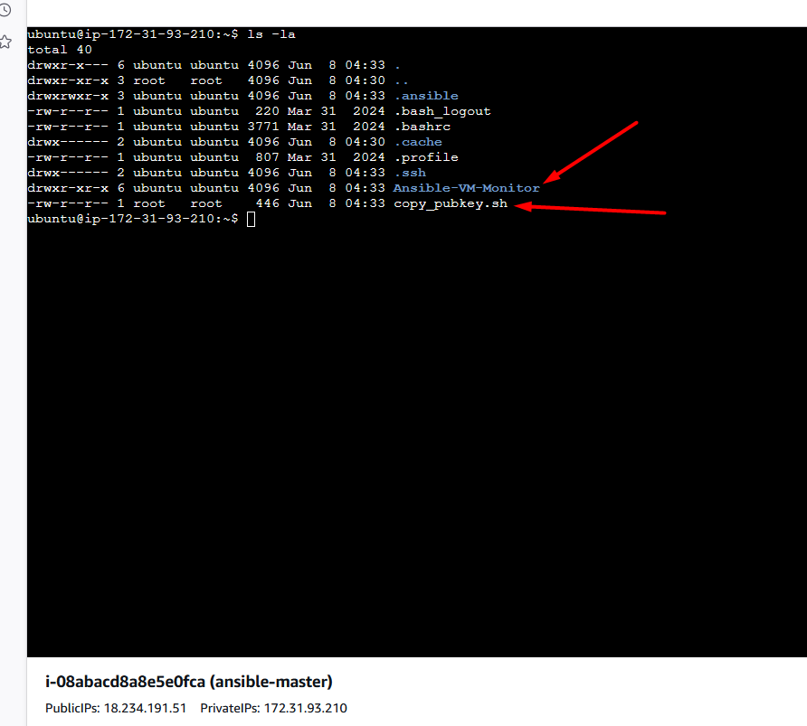
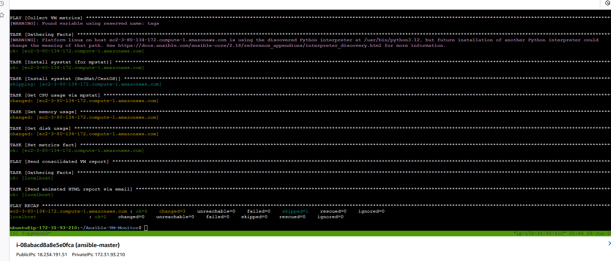
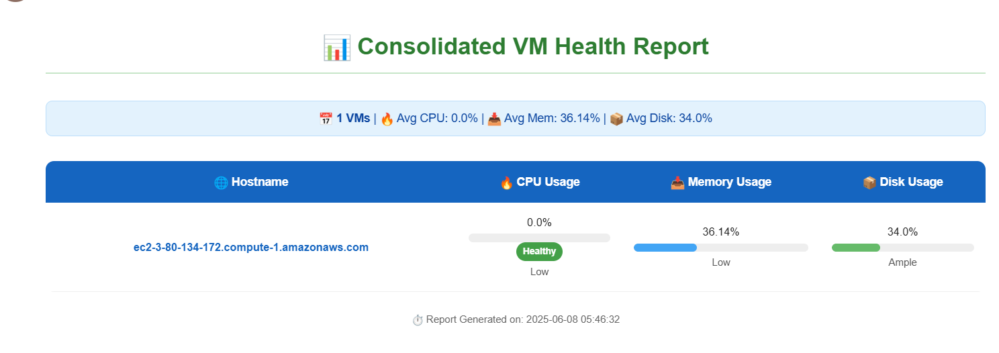

# Solution for Ansible Master and Agent Setup

I'll update the Terraform code to set up an Ansible master server and 5 agent VMs with the necessary IAM role for the master to communicate with the agents.

## Step-by-Step Approach:

1. Create separate AWS instance resources for the master and agent VMs
2. Create an IAM role with necessary permissions for the Ansible master
3. Create an instance profile to attach the IAM role to the Ansible master
4. Update security groups to allow SSH communication between master and agents
5. Add appropriate user data scripts


After deployment, you'll need to:
1. Copy the SSH public key from the Ansible master to each agent's authorized_keys file
2. Test connectivity using the sample playbook in the master VM
3. Consider using AWS Systems Manager or a more secure method for SSH key distribution in production environments

Made changes.

Similar code found with 1 license type


sudo hostnamectl set-hostname new_hostname



cp /etc/ansible/inventory/aws_ec2.yaml aws_ec2.yaml


ansible-inventory --list

ansible-inventory -i /home/ubuntu/Ansible-VM-Monitor/inventory/aws_ec2.yaml --list

ansible-inventory -i inventory/aws_ec2.yaml --graph

repo is cloned and bash script is also created


ansible version

```sh
ansible --version
ansible [core 2.18.6]
  config file = /etc/ansible/ansible.cfg
  configured module search path = ['/home/ubuntu/.ansible/plugins/modules', '/usr/share/ansible/plugins/modules']
  ansible python module location = /usr/lib/python3/dist-packages/ansible
  ansible collection location = /home/ubuntu/.ansible/collections:/usr/share/ansible/collections
  executable location = /usr/bin/ansible
  python version = 3.12.3 (main, Feb  4 2025, 14:48:35) [GCC 13.3.0] (/usr/bin/python3)
  jinja version = 3.1.2
  libyaml = True
```
permission on ansible folder


- verify the ssh key file and notedown the path
  ```sh
  ls ~/.ssh/
  ```


move `aws_ec2.yaml` to `/home/ubuntu/Ansible-VM-Monitor/inventory` directory to verify that setup is working fine.
```sh
ubuntu@ip-172-31-93-210:/etc/ansible$ ls -la
total 32
drwxr-xr-x   4 ubuntu ubuntu 4096 Jun  8 04:33 .
drwxr-xr-x 112 root   root   4096 Jun  8 04:32 ..
-rw-r--r--   1 ubuntu ubuntu  266 Jun  8 04:32 ansible.cfg
-rw-r--r--   1 ubuntu ubuntu  242 Jun  8 04:32 aws_ec2.yaml
-rw-r--r--   1 ubuntu ubuntu   66 Jun  8 04:32 hosts
drwxr-xr-x   2 ubuntu ubuntu 4096 Jun  8 04:32 inventory
drwxr-xr-x   2 ubuntu ubuntu 4096 May 20 17:07 roles
-rw-r--r--   1 ubuntu ubuntu  286 Jun  8 04:33 test_playbook.yml
ubuntu@ip-172-31-93-210:/etc/ansible$ pwd
/etc/ansible
ubuntu@ip-172-31-93-210:/etc/ansible$ 
```
```sh
mv /etc/ansible/inventory/aws_ec2.yaml aws_ec2.yaml
```
- Move `ansible.cfg` to `/home/ubuntu/Ansible-VM-Monitor/` directory 
```sh
mv /etc/ansible/ansible.cfg .
```


- update the inventory location `ansible.cfg` file

current
```sh
ubuntu@ip-172-31-93-210:/etc/ansible$ ls -la
total 32
drwxr-xr-x   4 ubuntu ubuntu 4096 Jun  8 04:33 .
drwxr-xr-x 112 root   root   4096 Jun  8 04:32 ..
-rw-r--r--   1 ubuntu ubuntu  266 Jun  8 04:32 ansible.cfg
-rw-r--r--   1 ubuntu ubuntu  242 Jun  8 04:32 aws_ec2.yaml
-rw-r--r--   1 ubuntu ubuntu   66 Jun  8 04:32 hosts
drwxr-xr-x   2 ubuntu ubuntu 4096 Jun  8 04:32 inventory
drwxr-xr-x   2 ubuntu ubuntu 4096 May 20 17:07 roles
-rw-r--r--   1 ubuntu ubuntu  286 Jun  8 04:33 test_playbook.yml
ubuntu@ip-172-31-93-210:/etc/ansible$ pwd
/etc/ansible
ubuntu@ip-172-31-93-210:/etc/ansible$ 


ubuntu@ip-172-31-93-210:/etc/ansible$ cat ansible.cfg 
[defaults]
inventory = /etc/ansible/inventory/
host_key_checking = False
private_key_file = /home/ubuntu/.ssh/ansible_key
remote_user = ubuntu

[ssh_connection]
ssh_args = -o StrictHostKeyChecking=no -o UserKnownHostsFile=/dev/null

[inventory]
enable_plugins = aws_ec2
ubuntu@ip-172-31-93-210:/etc/ansible$ 
```


after
```sh
ubuntu@ip-172-31-93-210:~/Ansible-VM-Monitor$ cat ansible.cfg 
[defaults]
inventory = /home/ubuntu/Ansible-VM-Monitor/inventory/
host_key_checking = False
private_key_file = /home/ubuntu/.ssh/ansible_key
remote_user = ubuntu

[ssh_connection]
ssh_args = -o StrictHostKeyChecking=no -o UserKnownHostsFile=/dev/null

[inventory]
enable_plugins = aws_ec2
```
 Test the dynamic inventory:
Run:
```bash
ansible-inventory --list
```
You should now see your EC2 instances populated based on the `tag:Role=agent` filter.

Direct testing of this inventory source
If you want to explicitly test your dynamic inventory file:
```bash
ansible-inventory -i /home/ubuntu/Ansible-VM-Monitor/inventory/aws_ec2.yaml --list
```

```sh
buntu@ip-172-31-93-210:~$ ansible-inventory -i /etc/ansible/inventory/aws_ec2.yaml --graph

or 

ansible-inventory --graph


@all:
  |--@ungrouped:
  |--@aws_ec2:
  |  |--ec2-3-80-134-172.compute-1.amazonaws.com
  |--@name_ansible_agent_1:
  |  |--ec2-3-80-134-172.compute-1.amazonaws.com
  |--@tag_Role_agent:
  |  |--ec2-3-80-134-172.compute-1.amazonaws.com
ubuntu@ip-172-31-93-210:~$ 
```

- Create a new file called `file.pem`...it should be same as you used for provision the VM.
```sh
sudo chmod 400 file.pem
```


change the p
Now, we have to update the following info in `copy_pubkey.sh`
```sh
PEM_FILE="nameoffile.pem"
PUB_KEY=$(cat ~/.ssh/ansible_key.pub)
```
change the execute permission on file
```sh
ubuntu@ip-172-31-93-210:~$ ls -la
total 56
drwxr-x--- 6 ubuntu ubuntu 4096 Jun  8 04:51 .
drwxr-xr-x 3 root   root   4096 Jun  8 04:30 ..
drwxrwxr-x 3 ubuntu ubuntu 4096 Jun  8 04:33 .ansible
-rw------- 1 ubuntu ubuntu  113 Jun  8 04:38 .bash_history
-rw-r--r-- 1 ubuntu ubuntu  220 Mar 31  2024 .bash_logout
-rw-r--r-- 1 ubuntu ubuntu 3771 Mar 31  2024 .bashrc
drwx------ 2 ubuntu ubuntu 4096 Jun  8 04:30 .cache
-rw-r--r-- 1 ubuntu ubuntu  807 Mar 31  2024 .profile
drwx------ 2 ubuntu ubuntu 4096 Jun  8 04:33 .ssh
-rw-r--r-- 1 ubuntu ubuntu    0 Jun  8 04:37 .sudo_as_admin_successful
-rw------- 1 ubuntu ubuntu 4510 Jun  8 04:51 .viminfo
drwxr-xr-x 6 ubuntu ubuntu 4096 Jun  8 04:33 Ansible-VM-Monitor
-rw-rw-r-- 1 ubuntu ubuntu 1675 Jun  8 04:42 MYLABKEY.pem
-rw-r--r-- 1 ubuntu ubuntu  473 Jun  8 04:51 copy_pubkey.sh

ubuntu@ip-172-31-93-210:~$ chmod +x copy_pubkey.sh 

ubuntu@ip-172-31-93-210:~$ ls -la
total 56
drwxr-x--- 6 ubuntu ubuntu 4096 Jun  8 04:51 .
drwxr-xr-x 3 root   root   4096 Jun  8 04:30 ..
drwxrwxr-x 3 ubuntu ubuntu 4096 Jun  8 04:33 .ansible
-rw------- 1 ubuntu ubuntu  113 Jun  8 04:38 .bash_history
-rw-r--r-- 1 ubuntu ubuntu  220 Mar 31  2024 .bash_logout
-rw-r--r-- 1 ubuntu ubuntu 3771 Mar 31  2024 .bashrc
drwx------ 2 ubuntu ubuntu 4096 Jun  8 04:30 .cache
-rw-r--r-- 1 ubuntu ubuntu  807 Mar 31  2024 .profile
drwx------ 2 ubuntu ubuntu 4096 Jun  8 04:33 .ssh
-rw-r--r-- 1 ubuntu ubuntu    0 Jun  8 04:37 .sudo_as_admin_successful
-rw------- 1 ubuntu ubuntu 4510 Jun  8 04:51 .viminfo
drwxr-xr-x 6 ubuntu ubuntu 4096 Jun  8 04:33 Ansible-VM-Monitor
-rw-rw-r-- 1 ubuntu ubuntu 1675 Jun  8 04:42 MYLABKEY.pem
-rwxr-xr-x 1 ubuntu ubuntu  473 Jun  8 04:51 copy_pubkey.sh
ubuntu@ip-172-31-93-210:~$ 
```
```sh
ubuntu@ip-172-31-93-210:~$ ls -la
total 60
drwxr-x--- 6 ubuntu ubuntu 4096 Jun  8 05:23 .
drwxr-xr-x 3 root   root   4096 Jun  8 04:30 ..
drwxrwxr-x 3 ubuntu ubuntu 4096 Jun  8 04:33 .ansible
-rw------- 1 ubuntu ubuntu  113 Jun  8 04:38 .bash_history
-rw-r--r-- 1 ubuntu ubuntu  220 Mar 31  2024 .bash_logout
-rw-r--r-- 1 ubuntu ubuntu 3771 Mar 31  2024 .bashrc
drwx------ 2 ubuntu ubuntu 4096 Jun  8 04:30 .cache
-rw-r--r-- 1 ubuntu ubuntu  807 Mar 31  2024 .profile
drwx------ 2 ubuntu ubuntu 4096 Jun  8 04:33 .ssh
-rw-r--r-- 1 ubuntu ubuntu    0 Jun  8 04:37 .sudo_as_admin_successful
-rw------- 1 ubuntu ubuntu 9978 Jun  8 05:23 .viminfo
drwxr-xr-x 6 ubuntu ubuntu 4096 Jun  8 05:23 Ansible-VM-Monitor
-r-------- 1 ubuntu ubuntu 1675 Jun  8 04:42 MYLABKEY.pem
-rwxr-xr-x 1 ubuntu ubuntu  639 Jun  8 05:12 copy_pubkey.sh
ubuntu@ip-172-31-93-210:~$ ./copy_pubkey.sh 
[WARNING]: Found variable using reserved name: tags
Injecting key into ec2-3-80-134-172.compute-1.amazonaws.com
Warning: Permanently added 'ec2-3-80-134-172.compute-1.amazonaws.com' (ED25519) to the list of known hosts.
```

Now, test the test playbook

```bash
ansible-playbook -i inventory/ /etc/ansible/test_playbook.yml 
```
**Output:**
```sh
ubuntu@ip-172-31-93-210:~/Ansible-VM-Monitor$ ansible-playbook -i inventory/ /etc/ansible/test_playbook.yml 

PLAY [Test Ansible Connection] *******************************************************************************************************************************************************************************
[WARNING]: Found variable using reserved name: tags

TASK [Gathering Facts] ***************************************************************************************************************************************************************************************
[WARNING]: Platform linux on host ec2-3-80-134-172.compute-1.amazonaws.com is using the discovered Python interpreter at /usr/bin/python3.12, but future installation of another Python interpreter could
change the meaning of that path. See https://docs.ansible.com/ansible-core/2.18/reference_appendices/interpreter_discovery.html for more information.
ok: [ec2-3-80-134-172.compute-1.amazonaws.com]

TASK [Ping test] *********************************************************************************************************************************************************************************************
ok: [ec2-3-80-134-172.compute-1.amazonaws.com]

TASK [Get hostname] ******************************************************************************************************************************************************************************************
changed: [ec2-3-80-134-172.compute-1.amazonaws.com]

TASK [Display hostname] **************************************************************************************************************************************************************************************
ok: [ec2-3-80-134-172.compute-1.amazonaws.com] => {
    "hostname_output.stdout": "ip-172-31-87-126"
}

PLAY RECAP ***************************************************************************************************************************************************************************************************
ec2-3-80-134-172.compute-1.amazonaws.com : ok=4    changed=1    unreachable=0    failed=0    skipped=0    rescued=0    ignored=0   
```

it works. now time to change in actual file.

1. first update the `all.yaml` file from `group_vars` folder
 
[Generate the application password](https://myaccount.google.com/apppasswords)


Now update the `collect_metric.yaml` file as we have to give `hostname`

 Using sed to update the file in-place:
```bash
sed -i 's/hosts: env_dev/hosts: tag_Role_agent/' collect_metrics.yaml
```
Verify the change:
```bash
grep '^hosts:' collect_metrics.yaml
```
```sh
ubuntu@ip-172-31-93-210:~/Ansible-VM-Monitor$ ansible-playbook -i inventory/ playbook.yaml
```




Outcome in email
